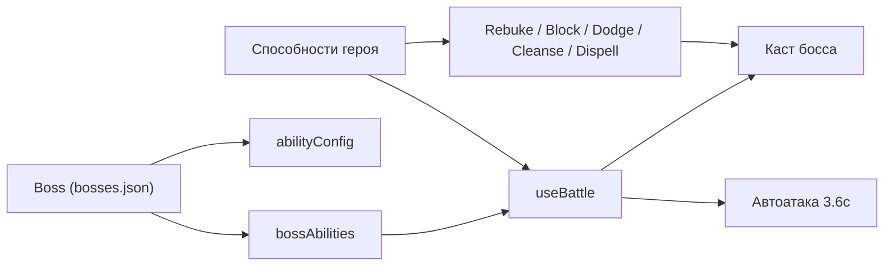

## Система способностей боссов

Этот документ описывает общую концепцию, модель данных и UX-паттерны для способностей боссов в PvE-проекте. Цель — сделать поведение боссов читаемым для игрока и легко расширяемым в коде.

- У каждого босса есть:
  - **Обычная автоатака** (фоновые удары по таймеру).
  - **Набор активных способностей**, которые требуют подготовки (каста), могут быть прерываемыми/непрерываемыми и взаимодействуют со способностями героя.
- Любая новая способность босса должна вписываться в описанные ниже паттерны и модель данных.

---

## 1. Общий обзор системы способностей боссов

- **Автоатака босса**
  - Базовая логика уже реализована: босс выполняет обычный удар по герою каждые ~**3.6 секунды**.
  - Автоатака **не имеет отдельной полосы каста** и воспринимается игроком как фоновый ритм боя.
  - Пока босс не применяет активную способность, именно автоатака задаёт основной источник входящего урона.

- **Активные способности босса**
  - Это отдельные, более сильные действия, которые:
    - Требуют **каста** (подготовки) и телеграфируются полосой каста и иконкой.
    - Временно **останавливают автоатаку** босса на время подготовки.
    - Часто имеют **особые условия контры**: прерывание `rebuke`, использование `block`, `evasion`, будущего `Cleanse` и т.д.
  - Для каждой способности задаются:
    - Базовая информация (`id`, `name`, `type`, `icon`, `cooldownMs` и т.д. — по аналогии с `Ability`).
    - Параметры каста (длительность, прерываемость, тип).
    - Эффекты (урон, DoT, дебаффы, бафы на боссе и т.п.).

- **Связь с текущей системой способностей героя**
  - Базовый тип `Ability` уже описан в `src/features/abilities/model/types.ts` и используется, например, в:
    - `src/features/abilities/model/abilities.ts`
    - `src/features/abilities/model/blade-and-poison.ts`
  - Способности босса могут быть реализованы:
    - Либо как надстройка над `Ability` (расширенный `BossAbility`),
    - Либо как отдельный тип с пересекающимися полями.
  - Взаимодействие: способности героя с `interrupt: true` (например, `rebuke`) и защитные способности (`evasion`, `block`, `shadow-cloak`) специально учитываются в логике обработки способностей босса.

---

## 2. UI и UX каста способностей босса

### 2.1. Расположение и визуальный паттерн

- **Зона отображения**
  - Иконка текущей способности босса и полоса каста отображаются в блоке босса на странице битвы (`Battle`):
    - Рекомендуемое место — рядом с аватаром и полосой HP босса, над ними или сразу под ними.
  - В каждый момент времени у босса может быть **только один активный каст**:
    - Либо ничего не кастуется (индикатор скрыт),
    - Либо идёт каст одной конкретной способности (одна иконка, одна полоса).

- **Иконка способности**
  - Отображает текущую активную способность (пример: `IconFireball`, `IconSmash`).
  - Может отличаться по цвету/рамке в зависимости от категории:
    - Прерываемые способности (interruptible) — подчеркнутая рамка, возможен значок молнии/стоп-иконки.
    - Непрерываемые, требующие защиты — более «опасный» визуал (красная или фиолетовая рамка).

### 2.2. Полоса каста

- **Базовые параметры**
  - Базовая длительность каста: **3 000 мс (3 секунды)**.
  - Полоса каста визуально:
    - Заполняется слева направо.
    - Имеет цвет по умолчанию (например, жёлто-оранжевый как предупреждение).
    - Может менять цвет в зависимости от типа способности (см. ниже).

- **Изменение скорости каста**
  - Фактическая длительность каста может отличаться от базовой 3-секундной:
    - Бафы/дебаффы скорости каста.
    - Особые механики конкретного босса.
  - UI всегда отображает **реальное оставшееся время**:
    - Прогресс-бар рассчитывается от `timeRemaining / totalCastTime`.
    - Текстовое отображение (по желанию): «2.1 с», «1.0 с» до удара.

### 2.3. Статусы каста

- **Состояния**
  - `idle`
    - Босс ничего не кастует.
    - Иконка способности и полоса каста **скрыты**.
  - `casting`
    - Начинается при старте применения способности.
    - Отображаются:
      - Иконка текущей способности.
      - Полоса каста с прогрессом.
    - **Автоатака босса поставлена на паузу** (таймер обычной атаки останавливается).
  - `interrupted`
    - Каст был прерван способностью героя (например, `rebuke`) или другим контролем.
    - Полоса каста:
      - Мгновенно обнуляется.
      - Может проигрывать короткую анимацию «красного всплеска» или «дробления» полосы.
    - Эффекты способности босса **не применяются**, способность уходит на кулдаун.
  - `completed`
    - Полоса каста дошла до конца.
    - В этот момент:
      - Применяются эффекты способности (урон, DoT, баф и т.п.).
      - Статус возвращается в `idle`.

### 2.4. Логика паузы автоатаки

- При входе в состояние `casting`:
  - Текущий таймер автоатаки босса **останавливается/замораживается**.
  - Босс не совершает обычных ударов, пока активен каст.

- При `interrupted`:
  - После прерывания:
    - Эффекты способности босса не происходят.
    - Способность отправляется на кулдаун.
    - Таймер автоатаки **перезапускается с небольшим рандомным интервалом**, чтобы избежать ситуации «сразу после прерывания прилетает автоатака».

- При `completed`:
  - Сначала применяются эффекты способности.
  - Затем для автоатаки:
    - Заводится новый таймер автоатаки с учётом параметров скорости/замедления.

### 2.5. Телеграфирование и читаемость

- **Цель** — чтобы игрок по одному взгляду понимал:
  - Что босс сейчас делает.
  - Сколько времени осталось до удара.
  - Какой тип реакции нужен (прервать, заблокировать, переждать, очистить дебафф и т.п.).

- **Цвета и подсказки**
  - Цвет полосы и иконки может зависеть от категории способности:
    - Прерываемые касты (тип 2) — красная/оранжевая полоса, явный сигнал «жми `rebuke`».
    - Непрерываемые тяжёлые удары (тип 3) — тёмно-красная/фиолетовая полоса, акцент на защитных способностях.
    - Способности с длительным дебаффом/DoT (типы 4 и 5) — ядовито-зелёный или фиолетовый цвет.
    - Бафы на боссе (тип 6) — голубой/жёлтый цвет.
  - При наведении мыши на иконку:
    - Появляется тултип: название способности + краткое описание.
    - Желательно указывать **рекомендацию по контре**, например:
      - «Прерывается способностью `Укор (Rebuke)`».
      - «Можно пережить только под `Блоком` или 100% уклонением».
      - «Наложит длительный яд — снимайте `Cleanse`».

---

## 3. Типы способностей боссов (паттерны использования)

Ниже перечислены основные паттерны, на которые будут опираться все способности боссов. Конкретная способность может сочетать несколько аспектов (например, урон + DoT + дебафф до очистки).

### Тип 1. Обычная автоатака

- Уже реализованная механика:
  - Интервал между ударами — около **3.6 секунды**.
  - Не имеет отдельной полосы каста.
  - Урон зависит от статов босса (`power`, шанс крита, броня героя и т.д.).
- Правило взаимодействия с активными способностями:
  - Автоатака **приостанавливается**, если босс переходит в состояние `casting` для любой активной способности.

### Тип 2. Прерываемый каст (interruptible)

- **Описание**
  - Способность босса с кастом (обычно 3 секунды), которую можно **прервать** специальной способностью героя, например `rebuke` с `interrupt: true`.

- **Поля в модели (идея)**
  - `canBeInterrupted: true`
  - `interruptWindowMs?: number` — окно времени, в течение которого прерывание сработает (по умолчанию равно длительности каста).
  - Дополнительно могут быть теги вроде `category: 'interruptible'`.

- **Поведение**
  - При входе в каст:
    - Босс переходит в `casting`.
    - Запускается полоса каста на `castTimeMs` (по умолчанию 3000 мс).
  - Если в это время по боссу попадает способность героя с `interrupt: true`:
    - Статус меняется на `interrupted`.
    - **Эффекты способности босса не применяются**.
    - Способность уходит на кулдаун.
    - Автоатака перезапускается с небольшим случайным интервалом.

- **UI**
  - Полоса каста может подсвечиваться **красным/оранжевым**.
  - В тултипе явно указывается: «Прерывается `Укором (Rebuke)`».

### Тип 3. Непрерываемый каст (requires counter ability)

- **Описание**
  - Способность, которую **нельзя прервать** `rebuke`.
  - Для избежания урона/эффекта игрок должен заранее активировать **определённую защитную способность**:
    - Например, 100% уклонение (`dodge`), блок (`block`), мощное снижение урона (`shadow-cloak`), позже — другие варианты.

- **Поля в модели (идея)**
  - `canBeInterrupted: false`
  - `requiredDefensiveTag?: 'full-dodge' | 'block' | 'heavy-mitigation' | 'cleanse' | ...`
  - `category: 'uninterruptible'`

- **Поведение**
  - По завершении каста:
    - Способность босса пытается нанести урон или наложить эффект.
    - Если на герое активен баф с подходящим `defensiveTag`:
      - Урон может быть полностью предотвращён.
      - Либо сильно снижен (например, до 10–20%).
    - Если подходящей защиты нет — герой получает полный урон или сильный эффект.

- **UI**
  - Полоса каста более «тревожная»: тёмно-красный/фиолетовый цвет, усиленная анимация.
  - В описании: «Не прерывается `Укором`. Избежать можно только под `Блоком` или 100% уклонением».
  - В коде боя прерывание Укором допускается только если `canBeInterrupted` и категория способности **не** `uninterruptible` (двойная защита от ошибок в данных).

### Тип 4. Урон + DoT на герое (ограниченное время жизни эффекта)

- **Описание**
  - После успешного каста босс наносит урон и накладывает **DoT (damage over time)** на героя.
  - DoT может:
    - Наносить периодический урон.
    - Снижать характеристики героя (power, armor, evasion).
    - Делать и то, и другое.

- **Поля в модели (идея)**
  - `dotDurationMs: number` — сколько длится DoT.
  - `dotTickIntervalMs: number` — интервал между тиками.
  - `dotDamagePerTick?: number` или `dotTickDamageMultiplier?: number`.
  - `dotAffectsStat?: 'power' | 'armor' | 'evasion' | 'all'`.
  - `dotStatModifierPercent?: number` — насколько снижается характеристика.
  - `debuffType?: 'poison' | 'burn' | 'curse' | 'ground' | ...` — тип дебаффа для взаимодействия с `Cleanse`/`Teleport`.

- **Поведение**
  - После завершения каста:
    - Проверяется защита героя (есть ли щиты/уклонение и т.д.).
    - Если удар прошёл — на героя вешается DoT-эффект.
  - На UI героя:
    - Отображается иконка дебаффа с таймером.
    - Периодически лог боя показывает тики урона и возможные изменения статов.

### Тип 5. Дебафф до очистки (зависит от Cleanse)

- **Описание**
  - Дебафф, который **не имеет естественного времени истечения** (или оно очень длинное).
  - Висит на герое, пока тот не использует способность очистки, например `Cleanse`.

- **Поля в модели (идея)**
  - `debuffRequiresCleanse: true`
  - `debuffType: 'curse' | 'poison' | 'silence' | 'burn' | 'ground' | ...` — тип используется как `debuffType` активного эффекта на герое.
  - `debuffCanStack?: boolean` — может ли накладываться несколько раз.
  - `maxStacks?: number` — максимум стаков (если `debuffCanStack` = true).

- **Поведение**
  - После завершения каста:
    - На героя накладывается соответствующий дебафф.
    - Он может наносить урон, урезать статы, запрещать использование способностей и т.д.
  - Способность `Cleanse`:
    - Находит на герое дебаффы с `debuffRequiresCleanse: true` и подходящим `debuffType`.
    - Снимает их (все или ограниченное количество стаков).

### Тип 6. Баф на боссе

- **Описание**
  - Босс накладывает положительный эффект **на себя**:
    - Повышение урона.
    - Повышение уклонения/брони.
    - Отхил от входящего урона (lifesteal).
    - Отражение урона (thorns).

- **Поля в модели (идея)**
  - `selfBuffType: 'damage' | 'evasion' | 'armor' | 'thorns' | 'lifesteal' | ...`
  - `selfBuffValue: number`
  - `selfBuffDurationMs: number`
  - Дополнительно: общая система эффектов босса (аналог `AbilityEffect`).

- **Поведение**
  - После завершения каста:
    - На босса вешается buff-объект, влияющий на расчёт урона/защиты.
    - Например:
      - `selfBuffType: 'damage', selfBuffValue: 0.3` → +30% к урону на время.
      - `selfBuffType: 'thorns'` → часть входящего урона отражается в героя.

- **UI**
  - Пока активен важный баф:
    - Над/рядом с боссом отображается иконка бафа с таймером.
    - Можно использовать отдельный слот под «ключевые эффекты босса».

### Дополнительные предлагаемые паттерны

- **Телеграфируемый AoE-удар**
  - Очень сильная способность, которая через 3 секунды наносит большой урон.
  - В рамках 2D-прототипа её можно реализовать как обычный сильный непрерываемый каст (тип 3) с особыми визуальными эффектами.

- **Комбо-каст босса**
  - Скрипт из нескольких способностей подряд:
    - Например: баф на урон → сильный удар → DoT.
  - В дальнейшем можно описать сценарии типа:
    - При HP босса < 50% он всегда после `warcry` делает `smash`, а затем `bleed`.

- **Фазовые способности**
  - Включаются только при определённом проценте HP босса:
    - < 70% HP, < 30% HP и т.д.
  - Позволяют сделать бой «по фазам», когда поведение босса ощутимо меняется.

---

## 4. Модель данных для способностей босса

Базовый тип `Ability` уже содержит много полезной информации (id, name, type, cooldownMs, icon, эффекты, DoT, защитные флаги и т.д.). Для способностей босса можно ввести надстройку `BossAbility`, которая:

- **Либо** расширяет `Ability`,
- **Либо** повторяет его ключевые поля плюс добавляет поля для каста и взаимодействия с героем.

Пример интерфейса (концептуально):

```ts
export type BossAbilityCategory =
  | "interruptible"
  | "uninterruptible"
  | "dot"
  | "persistent_debuff"
  | "self_buff";

export type BossDefensiveTag =
  | "full-dodge"
  | "block"
  | "heavy-mitigation"
  | "cleanse";

export interface BossAbility /* extends Ability */ {
  // Базовая информация
  id: string;
  name: string;
  type: AbilityType; // "damage" | "heal" | "buff"
  icon?: string;
  cooldownMs: number;

  // Каст
  castTimeMs: number; // базово 3000 мс
  category: BossAbilityCategory;
  canBeInterrupted: boolean;
  interruptWindowMs?: number;
  requiredDefensiveTag?: BossDefensiveTag;

  // DoT / дебаффы
  dotDurationMs?: number;
  dotTickIntervalMs?: number;
  dotDamagePerTick?: number;
  dotAffectsStat?: "power" | "armor" | "evasion" | "all";
  dotStatModifierPercent?: number;

  debuffRequiresCleanse?: boolean;
  debuffType?: "curse" | "poison" | "silence" | "burn" | "fear" | "weakness";
  debuffCanStack?: boolean;
  maxStacks?: number;

  // Бафы на боссе
  selfBuffType?: "damage" | "evasion" | "armor" | "thorns" | "lifesteal";
  selfBuffValue?: number;
  selfBuffDurationMs?: number;

  // Эффекты (можно переиспользовать AbilityEffect)
  effects?: AbilityEffect[];
}
```

### Пример конфигурации способностей для «Гоблина-мага»

Ниже — пример того, как мог бы выглядеть набор способностей для босса `goblin-mage` (концептуально, в TS/JSON-формате).

```ts
export const GOBLIN_MAGE_ABILITIES: BossAbility[] = [
  {
    id: "fireball",
    name: "Огненный шар",
    type: "damage",
    icon: "IconFireball",
    cooldownMs: 8000,
    castTimeMs: 3000,
    category: "interruptible",
    canBeInterrupted: true,
    interruptWindowMs: 3000,
    effects: [
      { kind: "damage", baseDamageX: 1.5 },
      { kind: "dot", durationMs: 6000, tickIntervalMs: 2000, damagePerTick: 10 },
    ],
    dotDurationMs: 6000,
    dotTickIntervalMs: 2000,
    dotDamagePerTick: 10,
  },
  {
    id: "arcane-bomb",
    name: "Тайная бомба",
    type: "damage",
    icon: "IconArcaneBomb",
    cooldownMs: 12000,
    castTimeMs: 3000,
    category: "uninterruptible",
    canBeInterrupted: false,
    requiredDefensiveTag: "full-dodge",
    effects: [{ kind: "damage", baseDamageX: 2.5 }],
  },
  {
    id: "hex-curse",
    name: "Проклятье мага",
    type: "damage",
    icon: "IconCurse",
    cooldownMs: 20000,
    castTimeMs: 3000,
    category: "persistent_debuff",
    canBeInterrupted: true,
    debuffRequiresCleanse: true,
    debuffType: "curse",
    debuffCanStack: false,
    effects: [
      { kind: "enemy_debuff_power_percent", value: -0.2 },
    ],
  },
  {
    id: "arcane-shield",
    name: "Тайный барьер",
    type: "buff",
    icon: "IconBarrier",
    cooldownMs: 25000,
    castTimeMs: 3000,
    category: "self_buff",
    canBeInterrupted: true,
    selfBuffType: "armor",
    selfBuffValue: 0.5, // +50% к эффективной броне
    selfBuffDurationMs: 8000,
  },
];
```

---

## 5. Тайминги и очередь действий босса

### 5.1. Общая идея

- Босс всегда находится в одном из нескольких состояний:
  - Ожидает следующую автоатаку.
  - Готовится кастовать способность.
  - Уже кастует способность.
  - Пережидает кулдауны между действиями.

- **Автоатака и способности не должны накладываться**:
  - Пока идёт каст способности, автоатака на паузе.
  - После завершения или прерывания каста автоатака перезапускается.

### 5.2. Интервалы и задержки

- Базовые параметры:
  - Интервал между автоатаками: около **3.6 секунды**.
  - Базовое время каста способности: **3 секунды**.

- **Интервал между автоатакой и началом каста**
  - Вводится параметр вида `minDelayAfterAutoBeforeCastMs`:
    - Например, 1000–1500 мс.
  - Цель:
    - Дать игроку **окно реакции** между получением обычного удара и началом опасного каста босса.
  - Можно использовать диапазон:
    - Например, `minDelayAfterAutoBeforeCastMs = 1000`, `maxDelayAfterAutoBeforeCastMs = 2000` для разнообразия.

### 5.3. Диаграмма состояний (концепция)

Для наглядности — упрощённая диаграмма состояний поведения босса:

```mermaid
stateDiagram-v2
    state idleState as "idle"
    state autoAttackPending as "autoAttackPending"
    state castingBossAbility as "castingBossAbility"
    state autoAttackCooldown as "autoAttackCooldown"

    [*] --> idleState
    idleState --> autoAttackPending: "startBattle"

    autoAttackPending --> autoAttackCooldown: "autoAttackHit"
    autoAttackPending --> castingBossAbility: "decideCastAbility"

    autoAttackCooldown --> autoAttackPending: "cooldownFinished"
    autoAttackCooldown --> castingBossAbility: "cooldownFinished+decideCastAbility"

    castingBossAbility --> autoAttackCooldown: "completed"
    castingBossAbility --> autoAttackCooldown: "interrupted"
```

- Интерпретация:
  - Босс начинает в `idle`, затем переходит в `autoAttackPending` (ожидание первого удара).
  - После автоатаки — либо:
    - Снова ждёт следующую автоатаку (`autoAttackCooldown` → `autoAttackPending`),
    - Либо решает начать каст способности (`castingBossAbility`).
  - После завершения или прерывания каста:
    - Возвращается в цикл автоатак через `autoAttackCooldown`.

---

## 6. Взаимодействие с способностями героя

### 6.1. Прерывание (`rebuke`)

- Способность героя `rebuke`:
  - Имеет `interrupt: true` в модели `Ability`.
  - При попадании по боссу во время состояния `casting`:
    - Проверяется, что текущая способность босса имеет `canBeInterrupted: true`.
    - Если да — каст прерывается (`interrupted`), эффекты босса не применяются.
    - Если `canBeInterrupted: false` — способность не прерывается, но урон от `rebuke` всё равно проходит как обычная атака.

### 6.2. Защитные способности (`evasion`, `dodge`, `block`, `shadow-cloak`)

- Существующие защитные способности героя (`blade-and-poison` класс и базовые):
  - `evasion` — даёт повышенный шанс уклонения на время.
  - `dodge` — гарантирует уклонение от **следующей особой атаки босса**, помеченной `requiredDefensiveTag: "full-dodge"` (флаг `defenseDodgeNext`).
  - `block` — блокирует особые атаки босса (`defenseBlockSpecials: true`).
  - `shadow-cloak` — уменьшает получаемый урон (`defenseDamageReductionPercent`).

- Для интеграции с паттернами способностей босса:
  - Эти способности можно пометить **дополнительными тегами**:
    - Например, `defensiveTag: 'full-dodge'` для способности, которая гарантирует уклонение.
    - `defensiveTag: 'block'` для способности, которая блокирует специальные удары.
  - Боссовые способности с `requiredDefensiveTag` будут проверять наличие соответствующего бафа на герое.

### 6.3. Очистка (`Cleanse`), позиционный сейв (`Teleport`) и дебаффы

- Способности героя `Cleanse` и `Teleport`:
  - Работают по **типам дебаффов** (`debuffType` в активных эффектах на герое).
  - `Teleport`:
    - Снимает дебаффы типа `"ground"` (пример: «огненная земля», лужи, зоны, в которых герой не должен стоять).
    - Реализован как способность с эффектом `cleanse` и `debuffTypes: ['ground']`.
  - `Cleanse`:
    - Снимает негативные эффекты типов `"poison"`, `"curse"`, `"burn"` и другие, помеченные как очищаемые.
    - Реализован как способность с эффектом `cleanse` и `debuffTypes: ['poison', 'curse', 'burn']`.

- Взаимодействие с типами способностей босса:
  - Тип 4 (ограниченный DoT) может:
    - Иметь фиксированную длительность и заканчиваться сам.
    - Дополнительно помечаться `debuffType` (например, `"poison"` или `"burn"`) — тогда `Cleanse` снимает такой DoT досрочно, удаляя соответствующий эффект из списка `playerDebuffs`.
  - Тип 5 (дебафф до очистки) глубоко завязан на `Cleanse`:
    - Без очистки эффект может почти не иметь естественного конца.
    - Дебаффы этого типа должны иметь корректно заданный `debuffType`, чтобы `Cleanse` мог их снять.
  - Позиционные механики (AoE под ногами героя) помечаются как `debuffType: 'ground'`:
    - Пока дебафф активен, герой получает периодический урон/штраф.
    - После нажатия `Teleport` все эффекты с `debuffType: 'ground'` снимаются, как будто герой вышел из зоны.

### 6.4. Диспелл бафов босса (`Dispell`)

- Способность героя `Dispell`:
  - Развевает (снимает) **положительные эффекты с босса**, которые помечены как диспеллимые.
  - Реализована как способность с эффектом `dispel` и `target: 'boss'` в модели `Ability`.

- Для бафов босса:
  - Каждый активный баф на боссе хранится как `ActiveEffect` в списке `bossBuffs`.
  - Если баф можно снять Dispell, он должен иметь `dispellable: true`.
  - Эффекты без `dispellable: true` считаются **неподвластными диспеллу** (ультимативные фазы, берсерк и т.п.).

- Взаимодействие:
  - При применении `Dispell`:
    - С канала `bossBuffs` удаляются все эффекты с `dispellable: true`.
    - В лог боя пишется, сколько бафов было снято.
  - При проектировании способностей типа 6 (бафы на боссе) важно явно решать:
    - Какие из бафов должны иметь контру через `Dispell`.
    - Какие остаются не снимаемыми, чтобы сохранять напряжение боя.

Пример концептуальной боссовой способности с огненной зоной:

```ts
{
  id: "fire-ground",
  name: "Огненная земля",
  type: "damage",
  category: "persistent_debuff",
  canBeInterrupted: false,
  debuffRequiresCleanse: false,
  debuffType: "ground",
  effects: [
    // накладывает на героя активный эффект с debuffType: "ground" и периодическим уроном
  ],
}
```

---

## 7. Баланс и расширяемость

### 7.1. Принципы баланса

- **Частота каста vs автоатаки**
  - Кастовые способности босса должны быть:
    - **Редче**, чем автоатаки.
    - Заметнее и опаснее.
  - Игрок должен воспринимать каст как событие, требующее отдельного внимания.

- **Окно реакции игрока**
  - Любая сильная способность босса должна:
    - Либо иметь достаточную длительность каста (3+ секунды).
    - Либо иметь ясный телеграф (цвет, иконка, тултип).
  - Игрок всегда должен иметь минимум одну **контр-реакцию**:
    - Прервать (`rebuke`),
    - Переждать под защитой (`block`, `evasion`),
    - Снять последствия (`Cleanse`).

### 7.2. Расширяемость

- Любая новая способность босса должна:
  - Быть отнесена к одному или нескольким **паттернам**:
    - `interruptible`, `uninterruptible`, `dot`, `persistent_debuff`, `self_buff` и т.п.
  - Использовать общую модель:
    - `BossAbility.category`, дополнительные поля, `effects`.
  - При необходимости нового типа взаимодействия:
    - Сначала описывается новая категория/тег в этом документе.
    - Затем добавляется в типы (`BossAbilityCategory`, `BossDefensiveTag`) и в реализацию.

- Такой подход позволяет:
  - Легко добавлять новых боссов и их уникальные способности.
  - Сохранять узнаваемость паттернов для игрока.
  - Избегать разрастания уникальных «особых случаев» в логике боя.

---

## 8. Паттерн настройки боя с боссом

Этот раздел — практический «рецепт», как спроектировать и настроить **полноценный бой с боссом** на основе уже реализованного дикого кабана `boar`. Цель — чтобы добавление нового босса сводилось к копированию и настройке понятного шаблона, без погружения во всю логику `useBattle`.

Полноценный босс в проекте описывается:

- **Объектом босса** в `[src/entities/boss/bosses.json](src/entities/boss/bosses.json)`:
  - базовые статы (`stats`) и служебная информация (уровень, редкость, награда, лут);
  - массив `bossAbilities` — активные способности босса (см. модель `BossAbility` в разделе 4);
  - `abilityConfig` — настройки таймингов и частоты использования способностей.
- **Логикой боя** в `[src/features/battle/model/useBattle.ts](src/features/battle/model/useBattle.ts)`:
  - автоатака босса каждые ~3.6 секунды;
  - планирование каста способностей босса;
  - взаимодействие с способностями героя (Rebuke, Block, Dodge, Cleanse, Dispell и т.д.).

Связь между данными и боевой логикой можно представить так:



### 8.1. Шаблон объекта босса

Базовый объект босса в `[src/entities/boss/bosses.json](src/entities/boss/bosses.json)` выглядит концептуально так:

```ts
{
  "id": "boss-id",
  "name": "Имя босса",
  "image": "/images/bosses/placeholder.jpg",
  "level": 5,
  "rarity": "rare",
  "xpReward": 150,
  "loot": ["item-id"],
  "stats": {
    "hp": 5000,
    "maxHp": 5000,
    "power": 20,
    "chanceCrit": 0.15,
    "evasion": 0.08,
    "speed": 2,
    "armor": 4
  },
  "buffs": [],
  "debuffs": [],
  "bossAbilities": [
    // 3–5 активных способностей босса (см. модель BossAbility и паттерны ниже)
  ],
  "abilityConfig": {
    "startDelayMs": 10000,
    "minAbilityIntervalMs": 15000,
    "preventConsecutiveRepeat": true
  }
}
```

Ключевые поля:

- **`stats`** — базовая сложность босса (живучесть, урон, крит, уклонение, броня).
- **`bossAbilities`** — список объектов `BossAbility` (см. раздел 4), описывающих, *что* и *как* босс кастует.
- **`abilityConfig`**:
  - `startDelayMs` — сколько времени после начала боя пройдёт до первой попытки каста способности;
  - `minAbilityIntervalMs` — минимальный интервал между кастами способностей (между собой и относительно автоатак);
  - `preventConsecutiveRepeat` — если `true`, босс не будет кастовать одну и ту же способность два раза подряд.

### 8.2. Бой с диким кабаном (`id: boar`) как эталон

Босс `boar` в `[src/entities/boss/bosses.json](src/entities/boss/bosses.json)` — пример полностью настроенного боя:

- Статы:
  - `hp: 5000`, `power: 14`, `chanceCrit: 0.12`, `evasion: 0.08`, `armor: 4` — средний запас HP, умеренный урон, заметный крит и уклонение, лёгкая броня.
- Конфигурация способностей:
  - `abilityConfig.startDelayMs = 10000` — первые ~10 секунд игрок знакомится с автоатакой и успевает нажать базовые способности.
  - `abilityConfig.minAbilityIntervalMs = 15000` — между активными способностями есть пауза, чтобы игрок не тонул в непрерывных кастах.
  - `preventConsecutiveRepeat = true` — кабан не может заспамить одну и ту же механику.

Активные способности кабана и их паттерны:

- `sharpen-tusks`
  - `category: "self_buff"`, `canBeInterrupted: true`, `selfBuffType: "damage"`, `selfBuffValue: 3.0`, `selfBuffDurationMs: 11000`, `dispellable: true`.
  - Паттерн: **баф на боссе** (тип 6) → сильное усиление урона на время, которое можно **прервать** (Rebuke) или **снять** (Dispell).
- `infected-bite`
  - `category: "persistent_debuff"`, `canBeInterrupted: false`, `debuffRequiresCleanse: true`, `debuffType: "poison"`, `dotDurationMs`, `dotTickIntervalMs`, `dotDamagePerTick`.
  - Паттерн: **дебафф до очистки** (тип 5) + DoT (тип 4) → яд, который тикает, пока игрок не нажмёт **Cleanse**.
- `furious-charge`
  - `category: "uninterruptible"`, `canBeInterrupted: false`, `requiredDefensiveTag: "ice-wall"`, высокий `baseDamageX`.
  - Паттерн: **непрерываемый тяжёлый каст** (тип 3), контрится только защитой с тегом «стена/блок спецов» (Стена льда / Block).
- `snout-slam`
  - `category: "uninterruptible"`, `requiredDefensiveTag: "full-dodge"`, высокий `baseDamageX`.
  - Паттерн: **непрерываемый удар под 100% уклонение** → контра через `dodge` / способности с гарантированным уклонением.
- `hooves-between-eyes`
  - `category: "uninterruptible"`, `requiredDefensiveTag: "block"`, высокий `baseDamageX`.
  - Паттерн: **непрерываемый удар под блок** → контра через щит/Блок.
- `eat-apple`
  - `category: "interruptible"`, `canBeInterrupted: true`, `type: "heal"`, `value: 500`.
  - Паттерн: **прерываемое лечение** (тип 2) → игрок обязан успеть нажать **Rebuke**.

Связь «способность босса → чем контрится у игрока»:

| Способность босса           | Категория / паттерн              | Основная контра героя                            |
|----------------------------|-----------------------------------|--------------------------------------------------|
| `sharpen-tusks`            | self_buff, dispellable           | `rebuke` (прервать каст), `dispell` (снять баф) |
| `infected-bite`           | persistent_debuff + DoT (яд)     | `cleanse` (снять яд)                            |
| `furious-charge`          | uninterruptible, requiredDefensiveTag: "ice-wall" | `ice-wall` / блок спец-атак                    |
| `snout-slam`              | uninterruptible, requiredDefensiveTag: "full-dodge" | `dodge` / 100% уклонение                       |
| `hooves-between-eyes`     | uninterruptible, requiredDefensiveTag: "block" | `block`                                         |
| `eat-apple`               | interruptible heal               | `rebuke`                                         |

Таким образом, бой с кабаном демонстрирует полный набор взаимодействий: прерывание, блок, уворот, очистку дебаффов и диспелл бафов.

Аналогичные паттерны частично используются и у других боссов:

- Волк (`wolf`): `howl` — self‑buff урона на время.
- Гоблин‑арбалетчик (`goblin-crossbowman`): `rapid-reload` — self‑buff урона на время.
- Гоблин‑маг (`goblin-mage`): `arcane-shield` — баф брони на время.
- Голем (`golem`): `stone-skin-buff` — баф брони на время.
- Пещерный дракон (`dragon`): `scale-armor` — баф брони на время.

Эти бафы реализованы через общую систему `bossBuffs` и влияют на расчёт эффективного урона/брони в `useBattle` так же, как `sharpen-tusks` и `roar` у кабана и медведя.

### 8.2.1. Бейджи типа атаки в UI

Во время каста способности босса в `BossCard` поверх полосы каста отображаются небольшие **бейджи**, которые помогают быстро понять, что делать:

- **Прерываемая**
  - Показывается, если `category: "interruptible"` и `canBeInterrupted: true`.
  - Подсказка: можно (и обычно нужно) нажать `Rebuke`, чтобы сорвать каст.
- **Не прерывается**
  - Показывается, если `category: "uninterruptible"`.
  - Подсказка: `Rebuke` не сработает, нужен защитный сейв.
- **Фронтальная**
  - Показывается, если у способности `requiredDefensiveTag: "ice-wall"`.
  - Подсказка: атака, рассчитанная на фронтальный урон по герою; переживается через `Стена льда` (или аналоги с этим тегом).
- **Войда**
  - Показывается, если у способности `debuffType: "ground"` (атаки, создающие опасную зону/лужу под героем, от которой нужно «уйти»).
  - Подсказка: избегается через `Телепорт` (очищает `ground`‑дебаффы) или выход из зоны.
- **Блокируемая**
  - Показывается, если у способности `requiredDefensiveTag: "block"`.
  - Подсказка: можно пережить через `Блок` (щит или стена, блокирующие особые удары).
- **Увернуться**
  - Показывается, если у способности `requiredDefensiveTag: "full-dodge"`.
  - Подсказка: спасает только 100% уклонение (`Уворот` и другие способности с таким эффектом).

Для кабана это выглядит так:

- `furious-charge` → бейдж **«Не прерывается»** + **«Фронтальная»**.
- Возможные будущие способности с `debuffType: "ground"` → бейджи **«Не прерывается»** (если не прерываемая) + **«Войда»**.
- `hooves-between-eyes` → **«Не прерывается»** + **«Блокируемая»**.
- `snout-slam` → **«Не прерывается»** + **«Увернуться»**.

### 8.3. Рецепт создания нового босса

Ниже — чеклист, по которому удобно идти при добавлении нового босса.

1. **Фантазия и роль босса**
   - Определить архетип: «толстый танк», «бурстовый убийца», «маг с DoT», «контрольный» и т.п.
   - Выбрать примерный уровень и редкость (`level`, `rarity`, `xpReward`) по аналогии с существующими боссами.
2. **Базовые статы**
   - Подобрать `hp`, `power`, `chanceCrit`, `evasion`, `armor` на фоне уже существующих записей в `[src/entities/boss/bosses.json](src/entities/boss/bosses.json)`.
   - Принципы:
     - много HP + высокая броня → долгий «толстый» босс;
     - мало HP + высокий урон/крит → стеклянная пушка;
     - высокая `evasion` → много промахов, лучше не сочетать с чрезмерным уроном.
3. **Набор активных способностей (паттерны)**
   - Рекомендуемый минимум: **3–5 способностей**, каждая привязана к одному или нескольким паттернам из этого документа и `[docs/ability-patterns.md](docs/ability-patterns.md)`:
     - 1 self-buff (тип 6) — усиление урона/брони, по возможности **диспеллимый** (`dispellable: true`).
     - 1–2 `uninterruptible` удара (тип 3) под разные сейвы: блок, полный уворот, сильное снижение урона (`shadow-cloak`).
     - 1 DoT / `persistent_debuff` (тип 4/5), завязанный на `Cleanse` или `Teleport` (через `debuffType`).
     - 1 прерываемое действие (heal или очень сильный удар) под `rebuke`.
   - Для каждой способности явно определить:
     - `category` (`interruptible`, `uninterruptible`, `dot`, `persistent_debuff`, `self_buff`);
     - возможность прерывания (`canBeInterrupted`);
     - необходимость конкретного сейва (`requiredDefensiveTag`) и **какой скилл героя** отвечает этому тегу.
4. **Тайминги и частота способностей**
   - Для каждой способности настроить:
     - `cooldownMs` — как часто босс может её использовать (отдельно от автоатаки);
     - `castTimeMs` — длительность каста (не делать слишком коротких кастов для опасных умений).
   - В `abilityConfig`:
     - выставить `startDelayMs`, чтобы у игрока было 5–15 секунд на освоение боя до первой сложной механики;
     - настроить `minAbilityIntervalMs`, чтобы способности не шли одна за другой без пауз;
     - включить `preventConsecutiveRepeat`, если не хотите спама одной и той же кнопки.
   - Эти поля используются логикой планирования кастов в `[src/features/battle/model/useBattle.ts](src/features/battle/model/useBattle.ts)` (`scheduleNextBossAbility`, `bossCastState` и др.).
5. **Баланс и плейтест**
   - Убедиться, что:
     - у каждого опасного действия босса есть минимум один явный сейв/контра;
     - длительность каста даёт игроку **окно реакции** (3+ секунды или явный телеграф);
     - автоатака + способности в сумме не убивают героя через 2–3 глобальных кулдауна.
   - Пройти бой несколько раз с разными билдами героя и отрегулировать `power`, `baseDamageX` и кулдауны по ощущениям.

### 8.4. Шаблон и чеклист для копирования

Минимальный шаблон записи босса, который удобно копировать при создании нового противника:

```ts
{
  "id": "boss-id",
  "name": "Имя босса",
  "image": "/images/bosses/placeholder.jpg",
  "level": 5,
  "rarity": "rare",
  "xpReward": 150,
  "loot": ["item-id"],
  "stats": {
    "hp": 5000,
    "maxHp": 5000,
    "power": 20,
    "chanceCrit": 0.15,
    "evasion": 0.08,
    "speed": 2,
    "armor": 4
  },
  "bossAbilities": [
    // 3–5 способностей по паттернам (self_buff, interruptible, uninterruptible, dot/persistent_debuff)
  ],
  "abilityConfig": {
    "startDelayMs": 10000,
    "minAbilityIntervalMs": 15000,
    "preventConsecutiveRepeat": true
  }
}
```

При создании нового босса обязательно:

- изменить `id`, `name`, `image`, `level`, `rarity`, `xpReward`, `loot`;
- подобрать `stats` под ожидаемую сложность;
- задать `bossAbilities` с осмысленными `category`, `canBeInterrupted`, `requiredDefensiveTag`, DoT/дебафф-частью и описанием контры;
- при необходимости добавить `buffs`/`debuffs` (для лора и будущих механик);
- настроить `abilityConfig` под желаемый ритм боя (частота кастов относительно автоатаки).

### 8.5. Краткий чеклист перед коммитом

Перед тем как закоммитить нового босса, быстро проверить:

- `bosses.json` валиден, `id` босса уникален, нет опечаток в полях.
- У каждой записи в `bossAbilities` понятный паттерн (interruptible / uninterruptible / dot / persistent_debuff / self_buff).
- Для всех `requiredDefensiveTag` есть соответствующая защитная способность героя.
- У опасных кастов есть контра (Rebuke, Block, Dodge, Cleanse, Dispell и т.п.) и достаточно времени на реакцию.
- `abilityConfig` не даёт боссу спамить кастами без пауз и не конфликтует с автоатакой.
- Бой с новым боссом пройден 2–3 раза и субъективно ощущается честным.


