# Диаграмма зависимостей модулей проекта PvE

Эта диаграмма показывает архитектуру проекта согласно методологии Feature-Sliced Design (FSD).

```mermaid
graph TB
    %% Слой APP
    App[app/App.vue]
    Main[app/main.ts]
    Router[app/router]
    Store[app/store]
    CharStore[app/store/character.ts]
    SkillsStore[app/store/skills.ts]
    
    %% Слой PAGES
    BattlePage[pages/Battle]
    BossSelectPage[pages/BossSelect]
    CharacterPage[pages/Character]
    MerchantPage[pages/Merchant]
    SkillsPage[pages/Skills]
    
    %% Слой FEATURES
    Battle[features/battle/model/useBattle]
    BattleEffects[features/battle/model/applyAbilityEffects]
    BattleUI[features/battle/ui]
    BossSelect[features/bossSelect/model]
    BossLoot[features/bossSelect/lib/getBossLoot]
    Abilities[features/abilities/model/abilities]
    BladePoison[features/abilities/model/blade-and-poison]
    Inventory[features/inventory/model/useInventory]
    PlayerProgress[features/character/model/usePlayerProgress]
    PlayerHp[features/character/model/usePlayerHp]
    Skills[features/skills]
    
    %% Слой ENTITIES
    Character[entities/character/model]
    CharacterUI[entities/character/ui]
    Boss[entities/boss/model]
    BossUI[entities/boss/ui]
    Item[entities/item/model]
    ItemsDB[entities/item/items-db]
    Merchant[entities/merchant/model]
    
    %% Слой SHARED
    HealthBar[shared/ui/HealthBar]
    EffectSlots[shared/ui/EffectSlots]
    AbilityTooltip[shared/ui/AbilityTooltip]
    DamageNumbers[shared/ui/DamageNumbers]
    Icons[shared/ui/icons]
    Cooldowns[shared/lib/cooldowns/useCooldowns]
    Effects[shared/lib/effects]
    Experience[shared/lib/experience]
    Labels[shared/lib/labels]
    Hotkey[shared/lib/hotkey]
    MerchantLib[shared/lib/merchant]
    
    %% APP зависимости
    Main --> App
    App --> Router
    App --> Store
    Router --> BattlePage
    Router --> BossSelectPage
    Router --> CharacterPage
    Router --> MerchantPage
    Router --> SkillsPage
    
    %% PAGES зависимости
    BattlePage --> Battle
    BattlePage --> BattleUI
    BattlePage --> Boss
    BattlePage --> Abilities
    
    BossSelectPage --> BossSelect
    BossSelectPage --> BossLoot
    BossSelectPage --> Boss
    
    CharacterPage --> Inventory
    CharacterPage --> PlayerProgress
    CharacterPage --> CharStore
    
    MerchantPage --> CharStore
    MerchantPage --> Merchant
    
    SkillsPage --> SkillsStore
    SkillsPage --> Abilities
    
    %% FEATURES зависимости
    Battle --> Character
    Battle --> Boss
    Battle --> Abilities
    Battle --> BladePoison
    Battle --> BattleEffects
    Battle --> Cooldowns
    Battle --> Experience
    Battle --> PlayerProgress
    Battle --> PlayerHp
    Battle --> CharStore
    Battle --> ItemsDB
    Battle --> DamageNumbers
    Battle --> Effects
    
    BattleEffects --> Effects
    BattleEffects --> DamageNumbers
    
    Abilities --> BladePoison
    
    BossSelect --> Boss
    BossSelect --> BossLoot
    
    BossLoot --> ItemsDB
    
    Inventory --> CharStore
    Inventory --> Item
    
    PlayerProgress --> CharStore
    PlayerHp --> CharStore
    
    BattleUI --> HealthBar
    BattleUI --> EffectSlots
    BattleUI --> AbilityTooltip
    BattleUI --> Cooldowns
    BattleUI --> Icons
    BattleUI --> Labels
    
    %% ENTITIES зависимости
    Character --> Boss
    CharacterUI --> HealthBar
    BossUI --> HealthBar
    ItemsDB --> Item
    
    CharStore --> Item
    CharStore --> ItemsDB
    CharStore --> Merchant
    CharStore --> MerchantLib
    
    %% SHARED зависимости (самодостаточны)
    AbilityTooltip --> Labels
    AbilityTooltip --> Hotkey
    
    %% Стили
    classDef appLayer fill:#ff6b6b,stroke:#c92a2a,stroke-width:2px,color:#fff
    classDef pagesLayer fill:#4ecdc4,stroke:#0d7377,stroke-width:2px,color:#fff
    classDef featuresLayer fill:#95e1d3,stroke:#38ada9,stroke-width:2px,color:#000
    classDef entitiesLayer fill:#ffd93d,stroke:#f4a460,stroke-width:2px,color:#000
    classDef sharedLayer fill:#a8dadc,stroke:#457b9d,stroke-width:2px,color:#000
    
    class App,Main,Router,Store,CharStore,SkillsStore appLayer
    class BattlePage,BossSelectPage,CharacterPage,MerchantPage,SkillsPage pagesLayer
    class Battle,BattleEffects,BattleUI,BossSelect,BossLoot,Abilities,BladePoison,Inventory,PlayerProgress,PlayerHp,Skills featuresLayer
    class Character,CharacterUI,Boss,BossUI,Item,ItemsDB,Merchant entitiesLayer
    class HealthBar,EffectSlots,AbilityTooltip,DamageNumbers,Icons,Cooldowns,Effects,Experience,Labels,Hotkey,MerchantLib sharedLayer
```



## Описание слоёв

### 🔴 APP (Красный)
**Назначение:** Точка входа приложения, инициализация, роутинг, глобальное состояние

**Ключевые модули:**
- `main.ts` — инициализация Vue-приложения
- `App.vue` — корневой компонент
- `router/` — настройка Vue Router
- `store/` — Pinia stores (character, skills)

### 🔵 PAGES (Бирюзовый)
**Назначение:** Страницы приложения, композиция фич

**Страницы:**
- `Battle` — экран боя с боссом
- `BossSelect` — выбор босса для битвы
- `Character` — инвентарь и экипировка персонажа
- `Merchant` — торговец (покупка/продажа предметов)
- `Skills` — управление навыками и способностями

### 🟢 FEATURES (Зелёный)
**Назначение:** Бизнес-логика, фичи приложения

**Основные фичи:**
- `battle/` — механика боя (урон, лечение, эффекты, кулдауны)
- `abilities/` — система способностей (базовые + класс "Клинок и Яд")
- `inventory/` — управление инвентарём
- `character/` — прогресс персонажа (уровень, опыт, HP)
- `bossSelect/` — выбор босса и определение лута

**Связи:**
- `useBattle` — центральная фича, объединяет персонажа, босса, способности, эффекты
- Использует `applyAbilityEffects` для обработки композиционных эффектов
- Интегрируется с системой кулдаунов, опыта, прогресса

### 🟡 ENTITIES (Жёлтый)
**Назначение:** Бизнес-сущности проекта

**Сущности:**
- `character/` — модель персонажа, базовые характеристики
- `boss/` — модель босса, общий интерфейс Stats
- `item/` — предметы экипировки
- `items-db.ts` — база данных предметов
- `merchant/` — модель торговца

**Связи:**
- `character` и `boss` используют общий интерфейс `Stats` (HP, power, chanceCrit, evasion, speed, armor)
- `characterStore` — центральное хранилище состояния персонажа (инвентарь, экипировка, золото)

### 🔵 SHARED (Голубой)
**Назначение:** Переиспользуемые компоненты и утилиты

**UI-компоненты:**
- `HealthBar` — полоса здоровья
- `EffectSlots` — отображение баффов/дебаффов
- `AbilityTooltip` — подсказки для способностей
- `DamageNumbers` — всплывающие числа урона/лечения
- `icons/` — SVG-иконки способностей

**Библиотеки:**
- `cooldowns/` — система перезарядки способностей
- `effects/` — система эффектов (баффы, дебаффы, DoT)
- `experience/` — расчёт опыта
- `labels/` — метки и названия
- `hotkey/` — обработка горячих клавиш
- `merchant/` — утилиты торговца

## Принципы архитектуры

1. **Однонаправленные зависимости**: зависимости идут только сверху вниз (app → pages → features → entities → shared)
2. **Изоляция слоёв**: каждый слой не знает о слоях выше себя
3. **Переиспользуемость**: shared-компоненты и entities могут использоваться в любых фичах
4. **Композиция**: pages собираются из features, features используют entities и shared

## Ключевые потоки данных

### Боевая система
```
BattlePage → useBattle → {
  Character (базовые статы)
  Boss (характеристики босса)
  Abilities (список способностей)
  applyAbilityEffects (обработка эффектов)
  useCooldowns (перезарядка)
  characterStore (экипировка → статы)
  usePlayerProgress (опыт, уровень)
}
```

### Система инвентаря
```
CharacterPage → useInventory → characterStore → {
  inventory (слоты предметов)
  equipped (надетая экипировка)
  equipmentStats (суммарные статы)
  items-db (база предметов)
}
```

### Система прогресса
```
useBattle (победа) → usePlayerProgress → characterStore → {
  level (текущий уровень)
  xp (опыт)
  persistedState (localStorage)
}
```
